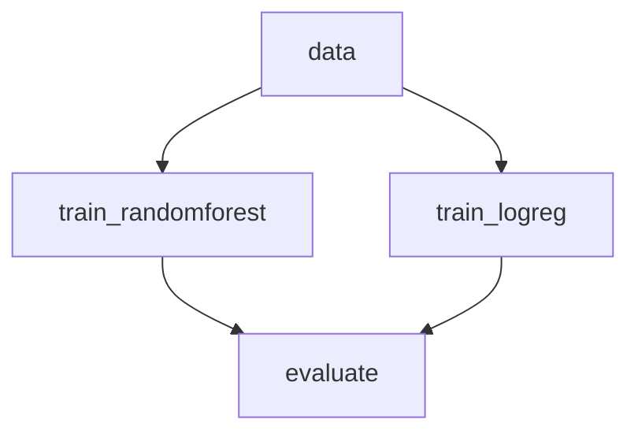

# Get started with DVC Studio

Pipeline for training a machine learning model using DVC Studio.



## Installation

```bash
python -m venv .venv
echo "PYTHONPATH=$PWD" > .venv/bin/activate
source .venv/bin/activate
pip install -r requirements.txt
```

## Run

### Run Python script with DVCLive 

```bash
python src/train_logreg.py
```

```bash
python src/train_randomforest.py
```

### Run DVC pipeline 

To run the pipeline, execute the following command:

```bash
dvc exp run
```

Run a separate stage with `-s` flag:

```bash
dvc exp run -s train_randomforest
```
